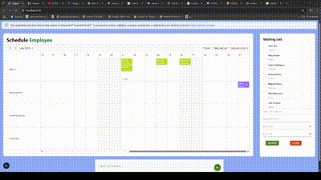

# 📅 AI Schedule Planner

**AI Schedule Planner** is a modern web application built with **Next.js** and **Tailwind CSS**, featuring an intelligent **dashboard** and integration with a custom **AI-powered API** to help users create, optimize, and manage their daily schedules effectively.

## 🧠 What It Does

- Lets users build and view personalized schedules.
- Uses artificial intelligence (via a custom API) to suggest optimal task arrangements.
- Includes a dynamic **dashboard** with a clear overview of tasks, time blocks, and suggestions.
- Responsive and user-friendly interface.
- Ideal for students, professionals, or anyone looking to improve time management.

## 🚀 Tech Stack

- [Next.js (App Router)](https://nextjs.org/)
- [React](https://reactjs.org/)
- [Tailwind CSS](https://tailwindcss.com/)
- [Vercel](https://vercel.com/) for deployment

## 🖼️ Live Demo

📷 Screens:

 <!-- Replace with your actual image -->

---

## ⚙️ Local Setup

Clone the repository and run the app locally:

```bash
git clone https://github.com/yourusername/ai-schedule-planner.git
cd ai-schedule-planner
npm install
npm run dev
```
